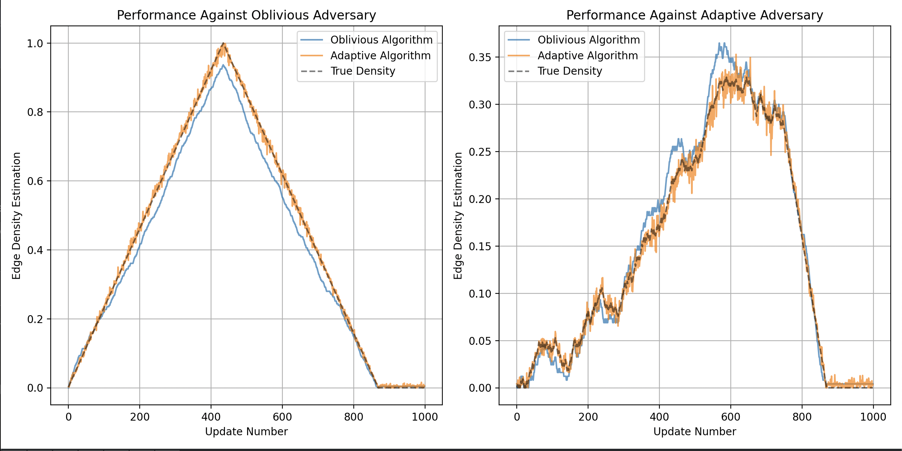
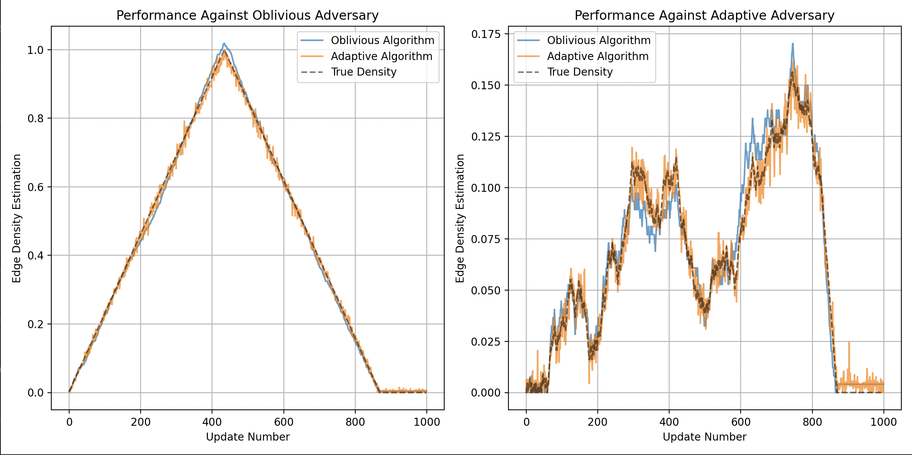
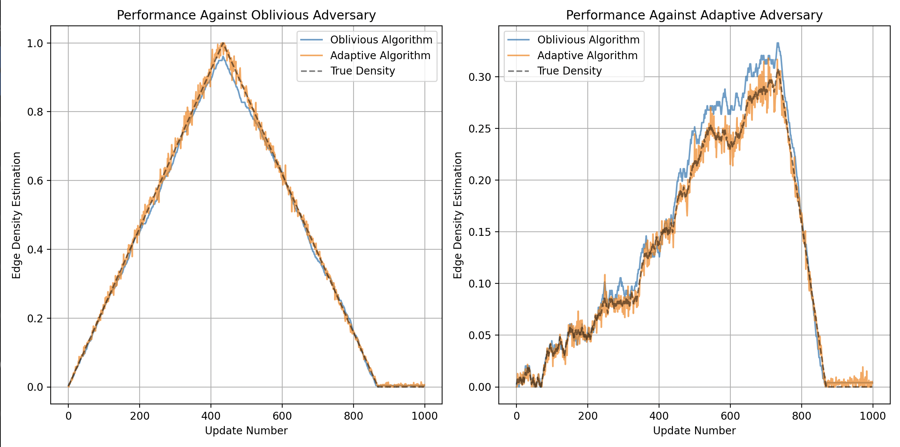

# Dynamic Algorithms Against Adaptive Adversary


This repository contains an implementation based on the paper ["Dynamic Algorithms Against an Adaptive Adversary: Generic Constructions and Lower Bounds"](https://arxiv.org/abs/2111.03980) by Beimel et al. We have implemented an oblivious and adaptive approximation algorithm for the edge density on a graph, with an oblivious and adaptive adversary to test the robustness of each algorithm. 

Here are some graphs showing the performance of the algorithms:





## Installation

1. Create a virtual environment:

```bash
python -m venv .venv
source .venv/bin/activate
```

2. Install dependencies:

```bash
pip install -r requirements.txt
```

3. Run the code:

```bash
python main.py
```

## Usage

The implementation provides several key components that can be used to build and test dynamic algorithms:

### Basic Data Structures

#### Graph
```python
# Initialize a graph with n vertices
graph = Graph(n_vertices=30)

# Add/remove edges
graph.add_edge(0, 1)
graph.remove_edge(0, 1)

# Get current edge density
density = graph.get_edge_density()
```

### Algorithms

#### Oblivious Algorithm
```python
# Initialize with a graph and privacy parameter
epsilon = 0.1
oblivious_algo = ObliviousAlgorithm(graph, epsilon)

# Handle updates (returns estimated density)
edge = (0, 1)
is_addition = True
density = oblivious_algo.handle_update(edge, is_addition)
```

#### Adaptive Algorithm
```python
# Initialize with graph, privacy parameter, and time horizon
T = 1000  # number of updates
adaptive_algo = AdaptiveAlgorithm(graph, epsilon, T)

# Handle updates (returns estimated density)
density = adaptive_algo.handle_update(edge, is_addition)
```

### Testing Framework

#### Adversary
```python
# Create an adversary (oblivious or adaptive)
adversary = Adversary(n_vertices=30, is_adaptive=True)

# Get next update
edge, is_addition = adversary.get_update(algorithm_response=0.5)  # For adaptive
edge, is_addition = adversary.get_update()  # For oblivious
```

### Running Experiments

To compare the performance of oblivious and adaptive algorithms against both types of adversaries:

```python
compare_algorithms(n_vertices=30, n_updates=1000)
```

This will generate plots showing how well each algorithm performs against both oblivious and adaptive adversaries.


## Authors

- [Tharun Kumar Tiruppali Kalidoss](https://www.linkedin.com/in/tharuntk/)
- [Shlok Shah](https://www.linkedin.com/in/shlok-shah-1807b4201/)
